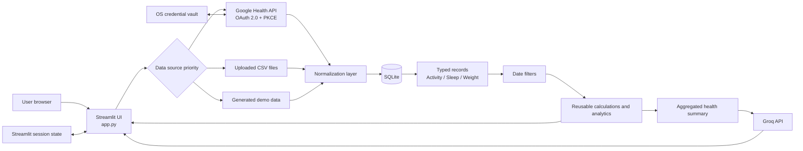
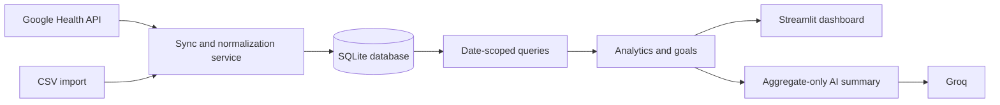
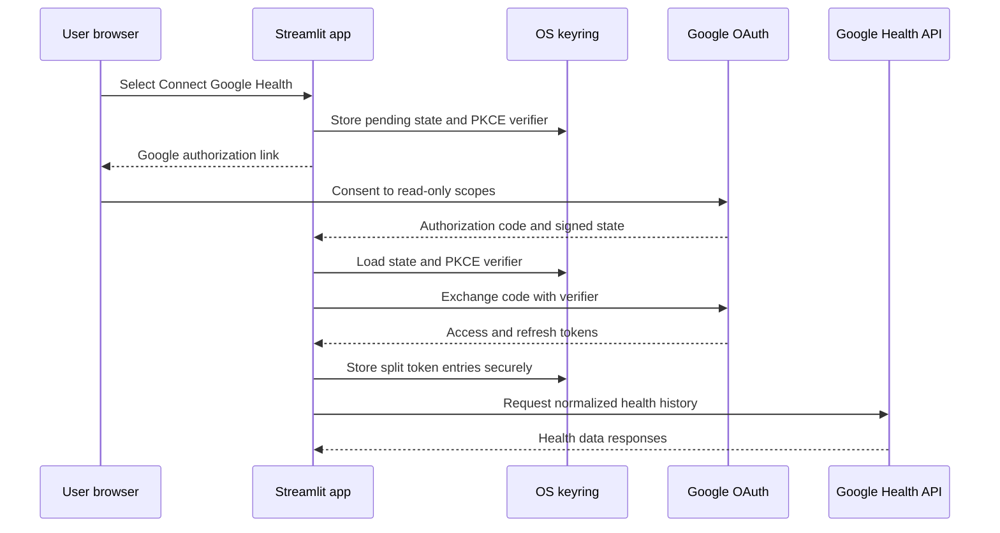
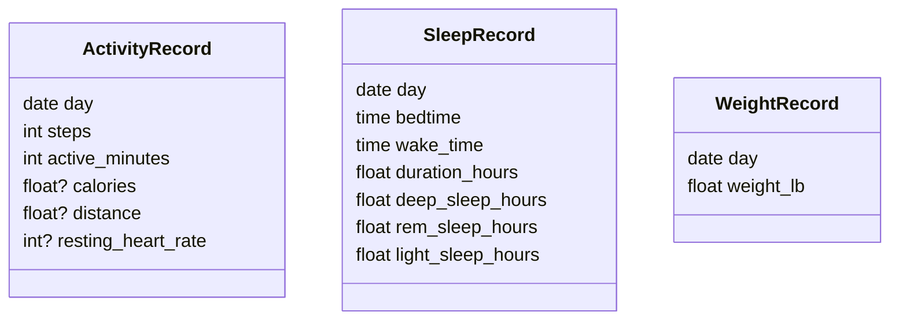
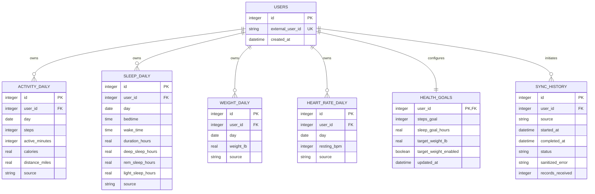

# My Health Tracker: Project Design & Operations Guide

**Document version:** 1.0  
**Application version:** 0.1.0  
**Last updated:** August 2026

## 1. Project overview

My Health Tracker is a Python and Streamlit application for viewing personal activity, sleep, weight, and overall wellness trends in one place. It combines data from the Google Health API, validated CSV uploads, or deterministic demo records and presents the normalized results through metrics, Plotly charts, goals, analytics, and an optional Groq-powered AI Health Coach.

The application is a personal trend viewer, not a medical device. It does not diagnose conditions, prescribe medication, or replace advice from a qualified healthcare professional.

### Why it was built

Personal health information often exists across wearable dashboards, exported files, and isolated metrics. That fragmentation makes it difficult to compare activity, sleep, and weight over the same period or to understand how day-to-day behavior changes over time. My Health Tracker provides a single, understandable interface while keeping the first release small enough to inspect and operate locally.

### Problem statement

Users need a simple way to:

- Consolidate activity, sleep, and weight observations.
- Review comparable periods using one set of historical filters.
- Monitor configurable health goals without complex setup.
- Calculate transparent trend metrics and correlations.
- Ask wellness-oriented questions without sending an unnecessary raw health history to an LLM.
- Continue using the application when an external integration is unavailable.

### Project goal

Create a clean, maintainable health-trend application that separates data acquisition, normalization, calculations, and presentation. The design should allow the same dashboard code to consume Google Health, CSV, or demo data without source-specific rewrites.

### What the application does

The current application:

- Retrieves up to one year of available Google Health history after OAuth consent.
- Accepts Activity, Sleep, and Weight CSV files as a fallback.
- Uses deterministic sample records when no connected or uploaded data exists.
- Normalizes each source into typed Python records.
- Applies shared historical date filters.
- Calculates activity, sleep, weight, goal, comparison, and correlation metrics.
- Presents results in five Streamlit tabs.
- Builds an automatic weekly summary locally.
- Sends aggregated statistics—not raw daily records—to Groq for optional conversational insights.

### Key health areas

| Area | Measurements |
|---|---|
| Activity | Steps, active minutes, calories, distance, resting heart rate |
| Sleep | Duration, bedtime, wake time, deep sleep, REM sleep, light sleep |
| Weight | Daily weight, 7-day average, 30-day average, target progress |

## 2. Functional scope

### Dashboard

The Dashboard is the cross-domain summary. It displays current steps, last-night sleep, current weight, and resting heart rate. Health Overview charts show steps, sleep duration, and weight trends for the active historical range. Health Insights adds period changes, activity extremes, goal rates, and date-aligned correlations.

### Activity tracking

The Activity tab includes:

- Today's steps, 7-day average steps, period average steps, and active minutes today.
- Daily steps and a 7-day moving average.
- Active minutes by day.
- Per-day 10,000-step goal achievement, using the configured goal rather than a hardcoded UI value.
- Available calories, distance, and resting-heart-rate data in the normalized activity records.

### Sleep tracking

The Sleep tab includes:

- Last-night duration, 7-day average, average bedtime, and average wake time.
- Daily duration and 7-day rolling average.
- Deep, REM, and light-sleep distribution.
- Bedtime trend.
- Clear identification of nights below the configured sleep target.

### Weight tracking

The Weight tab includes:

- Current weight, starting weight, change, and 30-day average.
- Daily weight, 7-day moving average, and 30-day moving average.
- Optional target weight and bounded target progress.

### Historical filters

A shared selector applies to relevant metrics, charts, moving averages, comparisons, and analytics:

- Last 7 Days
- Last 30 Days
- Last 90 Days
- Last 1 Year
- Custom Date Range

Preset ranges are inclusive and anchored to the latest record available in the selected source.

### Health goals

The sidebar lets the user configure:

- Daily steps goal; default 10,000.
- Daily sleep target; default 7 hours.
- Optional target weight.

Goals are stored durably in SQLite and mirrored into Streamlit session state for
responsive widget behavior.

### Health analytics

Reusable functions calculate:

- Week-over-week and month-over-month steps changes.
- Average sleep change.
- Weight change.
- Highest- and lowest-step days.
- Percentage of days meeting step and sleep goals.
- Pearson correlations for steps/sleep, steps/weight, and sleep/weight on shared dates.

Correlation is descriptive and does not imply causation.

### AI Health Coach

The AI Health Coach provides an automatic factual weekly summary and optional Groq-backed answers to questions such as:

- How was my health this week?
- How does my sleep compare with last month?
- Am I becoming more active?
- What patterns do you notice between activity and sleep?
- Summarize my last 30 days.

### Google Health and Fitbit compatibility

The implemented integration uses the **Google Health API**, the successor path for Fitbit Web API health data. It requests compatible activity, sleep, health-metric, and weight data associated with the user's Google/Fitbit account. The repository does not currently contain a legacy `fitbit_service.py` implementation or call the old Fitbit authorization endpoint.

### CSV fallback

CSV priority is below connected Google Health data and above demo data:

```text
Google Health records -> uploaded CSV -> generated demo records
```

Required columns and validation errors are displayed in the sidebar. Missing files never prevent the application from running.

### Explicitly out of current scope

- Multi-user or cloud-hosted database persistence.
- Multi-user accounts and authorization within the Streamlit application.
- Medical diagnosis, treatment, or medication recommendations.
- Background synchronization, webhooks, notifications, or scheduled jobs.
- A legacy Fitbit OAuth/API client separate from Google Health.

## 3. Solution architecture

### Current high-level architecture



### Component responsibilities

| Component | Responsibility |
|---|---|
| Streamlit UI | Page layout, sidebar controls, tabs, metrics, charts, feedback, and session state |
| Python application layer | Typed records, filtering, calculations, correlations, goal progress, source selection |
| Google Health integration | OAuth authorization, PKCE, secure token storage/refresh, API requests, normalization |
| CSV layer | Schema validation, type conversion, duplicate-date handling, meaningful errors |
| Demo layer | Deterministic local records for an immediately usable demo mode |
| Groq integration | Aggregate-only prompts, conversational responses, safety constraints |
| OS credential vault | Local OAuth access/refresh-token storage through `keyring` |

### SQLite persistence architecture

SQLite is implemented as the durable boundary between normalized sources and
the Streamlit dashboard:



This design makes data durable between Streamlit sessions and prevents repeated
one-year API downloads during ordinary Streamlit reruns. Database access remains
behind repository and service layers so UI calculations continue consuming the
same normalized record shapes.

### Data flow

Current flow:

1. The user authorizes Google OAuth with read-only scopes.
2. OAuth tokens are stored in the operating-system credential vault.
3. The application requests Google Health rollups and reconciled records.
4. API responses are converted into `ActivityRecord`, `SleepRecord`, and `WeightRecord` objects.
5. Normalized records are upserted into SQLite using date/source identifiers.
6. Sync status and sanitized failures are recorded.
7. Streamlit queries SQLite; validated CSV or demo data fills unavailable categories.
8. The shared date filter selects the active reporting period.
9. Reusable functions calculate metrics, rolling averages, goals, comparisons, and correlations.
10. Streamlit renders metrics and Plotly charts.
11. The AI Coach receives an aggregate summary only when the user asks a question.

## 4. Application design

### Dashboard design

The Dashboard uses responsive Streamlit columns for four prominent metric cards. Charts use consistent titles, labeled axes, restrained colors, hover details, and a wide layout. The Insights section uses concise metrics and explanatory text rather than opaque health scores.

### Activity tab

Activity emphasizes step behavior and daily movement. Goal achievement is categorical per day, while daily values and moving averages allow the user to separate day-to-day noise from the underlying pattern.

### Sleep tab

Sleep combines duration, clock-time trends, and stage composition. Bedtime calculations account for values crossing midnight. Target misses are shown as observations only; the application does not provide medical advice.

### Weight tab

Weight emphasizes gradual trends using raw measurements alongside 7- and 30-day averages. Target progress is optional and bounded between zero and 100 percent.

### AI Health Coach tab

The tab separates a deterministic weekly summary from API-generated conversation. The user can use example prompts or type a custom question. Recent conversation context is limited to reduce prompt size.

### Sidebar and settings

The sidebar contains:

- Application identity and description.
- Google Health connection, sync, and disconnect controls.
- CSV upload controls and expected formats.
- Health goals.
- Shared historical date range and custom dates.
- Active-source feedback and validation messages.

### UI screenshots

Actual screenshots are not committed in the current repository. They must be captured from a running instance so they reflect the operator's selected data source and do not expose personal health data. Store approved, redacted images under `docs/images/` using these names:

| Page | Suggested file | Capture state |
|---|---|---|
| Dashboard | `dashboard.png` | Demo data, Last 30 Days, Health Insights visible |
| Activity | `activity.png` | Daily steps and goal-achievement charts visible |
| Sleep | `sleep.png` | Duration, stages, and bedtime charts visible |
| Weight | `weight.png` | Trend lines and target progress visible |
| AI Health Coach | `ai-health-coach.png` | Weekly summary and example questions; no API key or personal response |
| Sidebar/settings | `sidebar-settings.png` | Demo/disconnected state, CSV formats, goals, date selector |

Capture procedure:

1. Run the app in demo mode.
2. Set the browser to a consistent desktop viewport, such as 1440 x 1000.
3. Collapse or omit any terminal, browser profile, email, token, or OAuth information.
4. Use synthetic/demo records only.
5. Save PNG files in `docs/images/` and embed them below after review.

```markdown


```

## 5. Project and file structure

### Current structure

```text
my-health-tracker/
|-- .streamlit/
|   `-- config.toml
|-- docs/
|   `-- PROJECT_DESIGN_OPERATIONS_GUIDE.md
|-- database/
|   |-- __init__.py
|   |-- connection.py
|   |-- migrations.py
|   `-- repository.py
|-- services/
|   |-- __init__.py
|   `-- health_sync_service.py
|-- tests/
|   |-- test_database.py
|   `-- test_google_health_integration.py
|-- .env.example
|-- .gitignore
|-- Activity.csv
|-- MyHealthTracker Prompts.txt
|-- README.md
|-- Sleep.csv
|-- Weight.csv
|-- activity_data.py
|-- ai_coach.py
|-- analytics.py
|-- app.py
|-- date_filters.py
|-- google_health_integration.py
|-- health_data.py
|-- pyproject.toml
|-- sample_data.py
|-- sleep_data.py
|-- uv.lock
`-- weight_data.py
```

The UI and calculation modules remain intentionally compact, while database and
sync responsibilities are separated into dedicated packages.

### Responsibility of every tracked file

| File | Responsibility |
|---|---|
| `app.py` | Configures Streamlit, selects the active data source, handles sidebar controls and OAuth callbacks, applies filters, and renders all tabs, metrics, insights, and Plotly charts. |
| `google_health_integration.py` | Implements Google OAuth with PKCE, signed state validation, secure keyring token storage, refresh handling, API request diagnostics, chunked historical retrieval, and normalization. |
| `database/connection.py` | Resolves the database path and configures transactional SQLite connections, foreign keys, WAL, and busy timeout. |
| `database/migrations.py` | Applies the versioned schema idempotently. |
| `database/repository.py` | Implements record upserts and retrieval, goals, source discovery, and sync history. |
| `services/health_sync_service.py` | Coordinates Google Health retrieval and CSV imports with database persistence. |
| `health_data.py` | Validates Activity, Sleep, and Weight CSV schemas and values; parses dates/times; handles duplicate dates; returns typed records and user-facing errors. |
| `activity_data.py` | Defines `ActivityRecord`, deterministic demo generation, step averages, moving averages, activity metrics, and step-goal calculations. |
| `sleep_data.py` | Defines `SleepRecord`, deterministic demo generation, sleep metrics, clock-time handling, rolling averages, and target calculations. |
| `weight_data.py` | Defines `WeightRecord`, deterministic demo generation, weight metrics, moving averages, and bounded target progress. |
| `analytics.py` | Provides cross-domain changes, extremes, goal rates, Pearson correlation, and date alignment. |
| `ai_coach.py` | Builds aggregate-only summaries, creates the local weekly summary, defines AI safety instructions, and calls Groq. |
| `date_filters.py` | Defines shared date options, inclusive bounds, filtering, and comparison-history helpers. |
| `sample_data.py` | Holds the original Dashboard placeholder series separately from UI code. |
| `tests/test_google_health_integration.py` | Tests OAuth state/PKCE, token refresh, normalization, error diagnostics, request chunking, sleep page limits, and resting-heart-rate filter rules. |
| `tests/test_database.py` | Tests migrations, duplicate-safe upserts, typed reads, source isolation, goals, and sync history using temporary databases. |
| `.streamlit/config.toml` | Defines the teal visual theme and minimal Streamlit toolbar. |
| `.env.example` | Lists required environment variables with non-secret placeholder values. |
| `.gitignore` | Excludes `.env`, `.venv`, Streamlit secrets, local token artifacts, caches, and editor/OS files. |
| `pyproject.toml` | Declares project metadata, Python requirement, runtime dependencies, development dependencies, and pytest configuration. |
| `uv.lock` | Locks resolved dependency versions for reproducible `uv` installations. |
| `README.md` | Provides concise setup, integration, startup, structure, and file-purpose documentation. |
| `Activity.csv` | Example activity CSV containing the supported activity columns. |
| `Sleep.csv` | Example sleep CSV containing duration, times, and stage columns. |
| `Weight.csv` | Example weight CSV containing dates and weights. |
| `MyHealthTracker Prompts.txt` | Records the incremental feature prompts that shaped the application. It is project history, not executable configuration. |
| `docs/PROJECT_DESIGN_OPERATIONS_GUIDE.md` | Provides the comprehensive design, operation, deployment, troubleshooting, and extension guide. |

### Local files that must not be committed

| File/directory | Reason |
|---|---|
| `.env` | Contains OAuth client secrets and the Groq API key. |
| `.venv/` | Local virtual environment; reproducible from `pyproject.toml` and `uv.lock`. |
| `.streamlit/secrets.toml` | Optional local/deployment secrets. |
| `__pycache__/`, `.pytest_cache/` | Generated caches. |
| `.fitbit/` | Reserved legacy token location and excluded defensively. |

## 6. Google Health / Fitbit integration

### Developer application

Create a Google Cloud project, enable the Google Health API, configure the OAuth consent screen, and create an OAuth 2.0 Web application client. While the application is in Testing mode, add intended users as OAuth test users.

The historical project prompt referred to a Fitbit developer application and old Fitbit authorization URL. The implementation was migrated to Google OAuth and Google Health API endpoints. Do not configure the old Fitbit authorization URL for this codebase.

### OAuth flow



### Authentication and token handling

- Authorization uses Google OAuth 2.0 web-server flow.
- PKCE binds the authorization request and callback using a verifier/challenge pair.
- A short-lived HMAC-signed state protects against callback/session mismatch and CSRF.
- `prompt=consent` and offline access request a refresh token.
- Access token, refresh token, and metadata are stored as separate keyring entries to remain within Windows Credential Manager payload limits.
- Expired access tokens are refreshed automatically.
- Disconnect removes the local credentials; users must revoke access in their Google account to revoke server-side consent.

### Read-only scopes

```text
https://www.googleapis.com/auth/googlehealth.activity_and_fitness.readonly
https://www.googleapis.com/auth/googlehealth.health_metrics_and_measurements.readonly
https://www.googleapis.com/auth/googlehealth.sleep.readonly
```

### APIs and data consumed

| Data | Google Health data type/operation | Normalized destination |
|---|---|---|
| Steps | `steps` daily rollup | `ActivityRecord.steps` |
| Distance | `distance` daily rollup | Miles in `ActivityRecord.distance` |
| Calories | `total-calories` daily rollup | `ActivityRecord.calories` |
| Active minutes | `active-minutes` daily rollup | `ActivityRecord.active_minutes` |
| Resting heart rate | `daily-resting-heart-rate` reconcile | `ActivityRecord.resting_heart_rate` |
| Sleep | `sleep` reconcile | `SleepRecord` duration, times, and stages |
| Weight | `weight` daily rollup | Pounds in `WeightRecord.weight_lb` |

Rollups use conservative 30-day chunks for general data and 14-day chunks for active minutes and total calories. Sleep reconciliation uses Google's maximum page size of 25. Daily summary filters use `>=` and an exclusive `<` end date.

### Refresh and error handling

- A 401 response triggers one credential refresh and retry.
- Non-success responses identify the method, endpoint, HTTP status, Google status, and sanitized message.
- OAuth errors distinguish state, PKCE, exchange, response conversion, and secure-storage failures.
- The UI falls back to CSV or demo data rather than crashing when connected data is missing.

### Security considerations

- Never hardcode or commit OAuth credentials.
- Use exact redirect URI matching in Google Cloud Console.
- Keep scopes read-only and minimal.
- Use HTTPS redirect URIs outside local development.
- Avoid logging authorization codes, tokens, request bodies, or health values.
- Restrict access to local machines and Streamlit deployments that hold secrets.
- Treat CSV uploads and health summaries as sensitive personal data.
- Rotate a secret immediately if it appears in logs, chat, Git history, or screenshots.

## 7. Data design

### Current normalized model



Records are immutable dataclasses. Dates provide the common key for filtering and correlation. Resting heart rate currently lives in `ActivityRecord`; a dedicated heart-rate model would be appropriate if intraday data or multiple readings are added.

### Goals and sync state

Goals and sync history are persisted in SQLite. Streamlit session state mirrors
the active goal widgets and retains only transient UI state:

- `steps_goal`
- `sleep_goal`
- `weight_goal_enabled`
- `target_weight`
- AI conversation messages

Health records, goals, and successful/failed sync metadata remain available
after application restarts.

### SQLite schema

The implemented schema follows this design:



Recommended constraints:

- Unique `(user_id, day, source)` on daily observation tables.
- Foreign keys enabled for every connection.
- UTC timestamps for operational events; civil dates/times for user-observed daily data.
- Parameterized SQL only.
- Database file excluded from Git and protected by operating-system permissions.
- Migrations and backups required before schema changes.

## 8. AI Health Coach

### Purpose

The coach summarizes calculated trends and helps users explore their own aggregated history in plain language. It is not a clinician and must not infer diagnoses.

### Groq integration

`ai_coach.py` uses the Groq Python client and the `llama-3.3-70b-versatile` model. The API key is read from `GROQ_API_KEY`. Calls use a 30-second timeout and low temperature (`0.3`) for restrained answers.

### Information sent to the LLM

Only the aggregate summary is sent:

- Reporting-period start and end.
- Record counts.
- Average steps and active minutes.
- Week-over-week step change.
- Best and lowest step values.
- Goal values, achieved counts, and percentages.
- Average sleep duration and stage averages.
- Starting/current/average weight and weight change.
- Rounded correlations.
- The current question and at most six recent conversation messages.

Daily rows, OAuth tokens, CSV contents, email addresses, and raw Google Health responses are not included. This data-minimization choice reduces exposure and prompt size while keeping enough context for trend-oriented answers.

### Prompt design and guardrails

The system prompt instructs the model to:

- Use only the supplied aggregate summary.
- Focus on neutral trends and wellness observations.
- Avoid disease diagnosis and medication recommendations.
- Avoid claiming to be a doctor.
- Label observations as distinct from medical advice.
- Acknowledge uncertainty and limited data.
- Refer diagnosis, treatment, medication, and urgent-help questions to qualified professionals.

### Limitations

- Aggregation can hide important daily variation.
- Correlations may be unstable with few shared dates.
- LLM output may still be incomplete or incorrect.
- The coach cannot assess symptoms, emergencies, clinical context, or medication safety.
- Groq availability, latency, model changes, and quotas are external dependencies.

## 9. Installation and configuration

### Prerequisites

- Python 3.11 or newer.
- `uv` package manager.
- Git for cloning.
- A modern browser.
- Optional: Google Cloud OAuth credentials and a Google/Fitbit account.
- Optional: Groq API key.

### Clone and install

```powershell
git clone https://github.com/rajmohandp/my-health-tracker.git
cd my-health-tracker
uv sync --link-mode copy
```

`--link-mode copy` is useful in OneDrive-backed folders. It can be omitted on filesystems that support hardlinks normally.

### Environment configuration

```powershell
Copy-Item .env.example .env
```

Set:

```dotenv
GROQ_API_KEY=your-groq-api-key
GOOGLE_HEALTH_CLIENT_ID=your-google-oauth-client-id
GOOGLE_HEALTH_CLIENT_SECRET=your-google-oauth-client-secret
GOOGLE_HEALTH_REDIRECT_URI=http://localhost:8501
```

Legacy `FITBIT_CLIENT_ID`, `FITBIT_CLIENT_SECRET`, and `FITBIT_REDIRECT_URI` names are accepted temporarily as aliases, but new configuration should use `GOOGLE_HEALTH_*`.

### Database initialization

The application applies versioned migrations through `HealthRepository` at
startup. The default file is `data/my_health_tracker.db`; override it with
`HEALTH_DATABASE_PATH`. Schema initialization is idempotent.

### Run locally

```powershell
uv run --link-mode copy streamlit run app.py
```

Equivalent direct virtual-environment command:

```powershell
.\.venv\Scripts\python.exe -m streamlit run app.py
```

Run from the repository root, not `.venv\Scripts`, so Streamlit can locate `app.py`.

### Validate

```powershell
.\.venv\Scripts\python.exe -m pytest -q
.\.venv\Scripts\python.exe -m py_compile app.py google_health_integration.py
```

## 10. User guide

### Start the application

Run Streamlit and open the displayed local URL, normally `http://localhost:8501`.

### Connect Google Health / Fitbit-backed data

1. Confirm Google Health OAuth environment variables are configured.
2. Select **Connect Google Health**.
3. Sign in to the intended Google account.
4. Approve the requested read-only scopes.
5. Return to the app through the OAuth callback.
6. Confirm **Google Health connected** appears.

### Sync data

Select **Sync Health**. The first sync requests up to one year of available data in API-compliant chunks. If an endpoint fails, the UI shows a sanitized method, data type, status, and Google error message.

### Use the Dashboard

Review the four current metrics, Health Overview charts, and Health Insights. Verify the active source and date range in the sidebar before interpreting comparisons.

### Read charts

- Raw lines show recorded daily values.
- Moving-average lines smooth short-term variation.
- Goal charts show daily achieved/not-achieved categories.
- Sleep stages divide recorded duration into deep, REM, and light portions.
- Correlation describes co-movement only; it does not establish cause.

### Change dates and goals

Choose a preset or custom range in the sidebar. Update steps and sleep goals, and optionally enable a target weight. Metrics and charts recalculate for the active records.

### Use the AI Health Coach

Review the automatic weekly summary, select an example question or enter a custom question, and submit it. Treat the response as a wellness observation, not medical advice.

### Use CSV fallback

Upload one or more supported CSV files. Valid uploaded data is used when Google Health records for that category are unavailable. Correct any displayed schema or row errors and upload again.

## 11. Deployment

### Local development

Local development is the primary supported deployment. OAuth tokens are stored in the logged-in user's OS credential vault. Do not run multiple Streamlit processes with different `.env` configurations because token/client-ID mismatches are difficult to diagnose.

### GitHub repository

The source is hosted at:

```text
https://github.com/rajmohandp/my-health-tracker
```

The repository is private at the time this guide was created. `.env` and local secrets are ignored.

### Streamlit Community Cloud

Before deployment:

1. Confirm the repository is accessible to Streamlit Community Cloud.
2. Add secrets through the deployment's secret manager, never Git.
3. Register the exact deployed HTTPS callback URL in Google Cloud Console.
4. Set `GOOGLE_HEALTH_REDIRECT_URI` to that exact URL.
5. Reassess token storage: OS `keyring` behavior in ephemeral cloud containers may not provide durable credentials.
6. Add a durable, encrypted token store before treating cloud OAuth as production-ready.

### Production considerations

- Use explicit application authentication and user isolation.
- Encrypt sensitive data at rest and in transit.
- Replace session-only storage with durable per-user persistence.
- Use a managed secret store.
- Add consent, privacy, retention, deletion, and export workflows.
- Review Google Health API terms and restricted/sensitive-scope requirements.
- Add structured, redacted logs and monitoring.
- Add rate-limit handling and exponential backoff for 429/504 responses.
- Perform threat modeling and dependency/security scanning.

## 12. Maintenance and troubleshooting

### Update dependencies

```powershell
uv lock --upgrade
uv sync --link-mode copy
.\.venv\Scripts\python.exe -m pytest -q
```

Review release notes before accepting major Streamlit, Plotly, Google OAuth, Google Health, keyring, Groq, or pandas upgrades. Commit `pyproject.toml` and `uv.lock` together.

### Google Health API changes

Monitor official data-type, endpoint, error-catalog, and release-note documentation. Pay particular attention to:

- Data-type identifiers and response-field names.
- Rollup date-range limits.
- Filter comparator restrictions.
- Page-size limits.
- Scope changes and OAuth verification requirements.

### OAuth and token issues

| Symptom | Likely cause | Resolution |
|---|---|---|
| `redirect_uri_mismatch` | Callback differs from Google Cloud registration | Make scheme, host, port, path, and trailing slash identical. |
| App unverified warning | Consent screen is in Testing or scopes require verification | Add a test user for development or complete verification for production. |
| State mismatch | Callback opened a new session or state expired | Start a new connection and finish within ten minutes. |
| Missing code verifier | Pending PKCE data expired or was replaced | Start a new authorization; do not reuse callback URLs. |
| Invalid grant | Reused/expired code or client mismatch | Restart Streamlit with the correct `.env` and reconnect. |
| Connected in one process only | Stale process or different inherited client ID | Stop all Python processes, restart from repository root, reconnect. |
| Token refresh fails | Refresh token revoked or client changed | Disconnect/revoke and authorize again. |

### Google Health request issues

| Error | Resolution |
|---|---|
| Steps daily rollup `INVALID_ARGUMENT` | Use conservative chunks and omit unnecessary page size. |
| Sleep invalid page size | Use a maximum reconcile page size of 25. |
| Resting-heart-rate invalid comparator | Use `>= start` and `< exclusive_end`; `<=` is unsupported. |
| 401 | Refresh once, then reconnect if refresh fails. |
| 403 missing scope | Reauthorize with required read-only scopes. |
| 429/504 | Add bounded exponential backoff; do not immediately repeat a year-long sync. |

### Groq failures

- Confirm `GROQ_API_KEY` is set in the process that starts Streamlit.
- Restart after changing `.env`.
- Check network access, model availability, quota, and Groq status.
- Keep the deterministic weekly summary available when Groq is unavailable.
- Never display or log the key.

### Database backup and rebuild

For SQLite backup and rebuild operations:

- Stop writes before file-level backup.
- Use SQLite's backup API or `VACUUM INTO` rather than copying an actively written file.
- Version migrations.
- Test restoration regularly.
- Require explicit confirmation before deleting or rebuilding user data.

### Logs

Streamlit currently writes operational messages to its terminal. API errors are sanitized for the UI. A future production version should use structured logs with correlation IDs and must redact:

- Access/refresh tokens.
- Authorization codes and PKCE verifiers.
- Client secrets and API keys.
- Raw health records and CSV contents.
- Personally identifying account information.

### Common local errors

| Error | Resolution |
|---|---|
| `File does not exist: app.py` | Change to the repository root before running Streamlit. |
| Streamlit will not stop | Press Ctrl+C again or stop the specific Python/Streamlit process. |
| `uv` link failure in OneDrive | Use `uv sync --link-mode copy`. |
| CSV missing columns | Use the exact documented headers. |
| Empty charts | Confirm the selected date range overlaps available records. |

### Add a new health metric

1. Confirm the source API operation, scope, limits, units, and response schema.
2. Add or extend a normalized record rather than passing raw source JSON to the UI.
3. Add source-specific parsing and unit conversion.
4. Add CSV schema support if appropriate.
5. Implement calculations in a reusable module.
6. Apply shared date filtering.
7. Add UI metrics/charts without source-specific branching.
8. Decide whether the aggregate AI summary needs the metric.
9. Add tests for request shape, normalization, missing data, and calculations.
10. Update this guide and the README.

## 13. Future enhancements

- Dedicated resting-heart-rate and intraday heart-rate analytics.
- Exercise/workout sessions and activity types.
- Transparent, explainable wellness scores.
- Multi-year and seasonal trend analysis.
- Improved AI comparisons with explicit confidence/data-coverage statements.
- Additional wearable integrations behind the same normalization interface.
- Optional migration from local SQLite to managed multi-user persistence.
- Incremental sync, webhooks, and sync history.
- Mobile-friendly navigation and chart layouts.
- User-controlled notifications and weekly summaries.
- Multi-user authentication, isolation, export, and deletion.
- Automated UI tests and approved screenshot generation.

## Appendix A: Environment variables

| Variable | Required | Purpose |
|---|---|---|
| `GOOGLE_HEALTH_CLIENT_ID` | For Google Health | OAuth web-client identifier |
| `GOOGLE_HEALTH_CLIENT_SECRET` | For Google Health | OAuth client secret |
| `GOOGLE_HEALTH_REDIRECT_URI` | For Google Health | Exact authorized callback URI |
| `GROQ_API_KEY` | For conversational AI | Authenticates Groq requests |
| `FITBIT_CLIENT_ID` | Deprecated alias | Temporary migration alias for Google client ID |
| `FITBIT_CLIENT_SECRET` | Deprecated alias | Temporary migration alias for Google client secret |
| `FITBIT_REDIRECT_URI` | Deprecated alias | Temporary migration alias for Google redirect URI |

## Appendix B: CSV formats

### Activity CSV

```csv
date,steps,active_minutes,calories,distance
2026-08-15,8450,42,2150,4.1
```

Rules: parseable date, non-negative numeric values, and every required column present.

### Sleep CSV

```csv
date,sleep_duration_hours,bedtime,wake_time,deep_sleep_minutes,rem_sleep_minutes,light_sleep_minutes
2026-08-15,6.75,23:15,06:00,75,87,243
```

Rules: positive sleep duration, parseable dates/times, and non-negative stage minutes.

### Weight CSV

```csv
date,weight
2026-08-15,160.0
```

Rules: parseable date and positive numeric weight in pounds.

For duplicate dates, the last CSV row wins and the application displays a warning.

## Appendix C: API references

- Google Health overview: <https://developers.google.com/health/about>
- Google Health data types: <https://developers.google.com/health/data-types>
- Google Health endpoints: <https://developers.google.com/health/endpoints>
- Google Health REST v4 reference: <https://developers.google.com/health/reference/rest/v4>
- Google OAuth web-server flow: <https://developers.google.com/identity/protocols/oauth2/web-server>
- Streamlit documentation: <https://docs.streamlit.io/>
- Groq documentation: <https://console.groq.com/docs>
- uv documentation: <https://docs.astral.sh/uv/>

## Appendix D: Database schema

See the ER diagram in **Data Design**. Before implementation, convert it into versioned migrations, choose conflict/upsert rules per source, and define data-retention and deletion requirements.

## Appendix E: Incremental prompts used to build the project

The complete historical prompt text is stored in `MyHealthTracker Prompts.txt`. The recorded build sequence is:

1. Create the basic Streamlit application shell.
2. Design the Dashboard.
3. Build the Activity tab.
4. Build the Sleep tab.
5. Build the Weight tab.
6. Add CSV data upload and validation.
7. Add historical filters.
8. Add session-based health goals.
9. Add reusable health analytics.
10. Add the Groq AI Health Coach.
11. Add a wearable/Fitbit integration, subsequently migrated to Google Health API.
12. Add a local SQLite database for normalized records, goals, and sync history.

Subsequent troubleshooting refined OAuth redirect handling, signed state, PKCE, Windows keyring storage, API diagnostics, daily-rollup chunking, sleep pagination, and daily-summary filter comparators.
